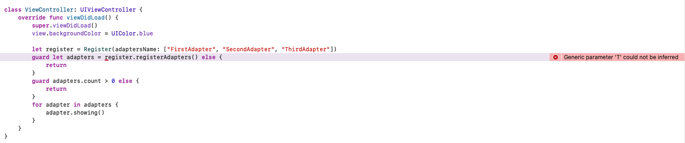
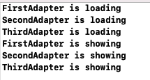

* [Swift 利用类名动态创建实例对象](#swift-利用类名动态创建实例对象)
   * [OC 通过字符串创建实例对象](#oc-通过字符串创建实例对象)
   * [Swift 中通过字符串创建实例对象](#swift-中通过字符串创建实例对象)
   
# Swift 利用类名动态创建实例对象
## OC 通过字符串创建实例对象
在OC中我们可以通过下列方法轻松创建实例对象
```objective-c
NSString *className = @"UIView";
Class class = NSClassFromString(className);
UIView *view = [[class alloc] init];
```
## Swift 中通过字符串创建实例对象
1. 获取命名空间
   ```swift
   func currentNameSpace() -> String? {
        guard let spaceName = Bundle.main.infoDictionary!["CFBundleExecutable"] as? String else {
            print("获取命名空间失败")
            return nil
        }
        return spaceName
    }
   ```
2. 获取类名并创建实例对象
   ```swift
   func registerAdapters<T>() -> [T]? where T: Adapter {
        guard let spaceName = currentNameSpace() else {
            return nil
        }
        var adapters: [T] = []
        for adapter in adaptersName {
            let fullName = spaceName + "." + adapter
            guard let metaClass = NSClassFromString(fullName) as? T.Type else {
                print("获取元类型失败")
                continue
            }
            
            adapters.append(metaClass.init(name: adapter))
        }
        return adapters
    }
   ```
   通过 NSClassFromString 获取到的元类型需要转成确定的类型，这里使用了范型 T: Adapter。
   Adapter 为声明的协议。
   ```swift
   protocol Adapter {
    init(name: String)
    func showing()
   }
   ```
3. 失败的尝试
   - 首先声明 3 个遵循 Adapter 协议的类
     - 注意：因为Adapter协议中声明了 init(name: String) 方法，所以实现init方法时，要加 required 关键字，代表其子类也要实现此 init 方法。
     - [DESIGNATED，CONVENIENCE 和 REQUIRED](https://swifter.tips/init-keywords/)
        ```swift
        class FirstAdapter: Adapter {
            var name: String!
            required init(name: String) {
                super.init(name: name)
                self.name = name
                print(name + " is loading")
            }
            
            func showing() {
                print(name + " is showing")
            }
        }

        class SecondAdapter: Adapter {
            var name: String!
            required init(name: String) {
                super.init(name: name)
                self.name = name
                print(name + " is loading")
            }
            
            func showing() {
                print(name + " is showing")
            }
        }

        class ThirdAdapter: Adapter {
            var name: String!
            required init(name: String) {
                super.init(name: name)
                self.name = name
                print(name + " is loading")
            }
            
            func showing() {
                print(name + " is showing")
            }
        }
        ```  

   - demo 报错信息   
        
   
   报错信息 `Generic parameter 'T' could not be inferred`
   不能推导出范型的具体类型。

4. 做的改进
   - 声明一个 FatherAdapter 类，遵循 Adapter 协议
     ```swift
     class FatherAdapter: Adapter {
     required init(name: String) {}
    
     func showing() {}
     }
     ``` 
   - FirstAdapter, SecondAdapter, ThirdAdapter 都继承 FatherAdapter  
     - 添加 super.init(name: name)
     - showing() 添加 override
   ```swift
    class FirstAdapter: FatherAdapter {
        var name: String!
        required init(name: String) {
            super.init(name: name)
            self.name = name
            print(name + " is loading")
        }
        
        override func showing() {
            print(name + " is showing")
        }
    }

    class SecondAdapter: FatherAdapter {
        var name: String!
        required init(name: String) {
            super.init(name: name)
            self.name = name
            print(name + " is loading")
        }
        
        override func showing() {
            print(name + " is showing")
        }
    }

    class ThirdAdapter: FatherAdapter {
        var name: String!
        required init(name: String) {
            super.init(name: name)
            self.name = name
            print(name + " is loading")
        }
        
        override func showing() {
            print(name + " is showing")
        }
    }
   ``` 
   - 改进 demo
     - let adapters: [FatherAdapter] = register.registerAdapters() 范型直接使用 FaterAdapter
   ```swift
   class ViewController: UIViewController {
    override func viewDidLoad() {
        super.viewDidLoad()
        view.backgroundColor = UIColor.blue
        
        let register = Register(adaptersName: ["FirstAdapter", "SecondAdapter", "ThirdAdapter"])
        guard let adapters: [FatherAdapter] = register.registerAdapters() else {
            return
        }
        guard adapters.count > 0 else {
            return
        }
        for adapter in adapters {
            adapter.showing()
        }
    }
   }
   ``` 
   - 运行结果   
      
   