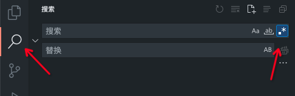
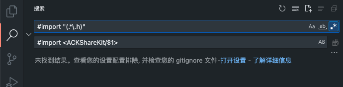

## 在VSCode中打开正则

## 引入问题
1. 想要查找所有以双引号 “” 导入的头文件
   - #import “People.h”
2. 将所有双引号导入的头文件替换为尖括号
   - #import <People/People.h>
## 解决问题

1. 查找所有以 `#import "` 开头, `.h"` 结尾的字符串
2. 替换为以 `#import <ACKShareKit/` 开头，`>` 结尾的字符串
3. 捕获组为（.*\.h）

[参考链接](https://juejin.cn/post/6844903856128671752)
