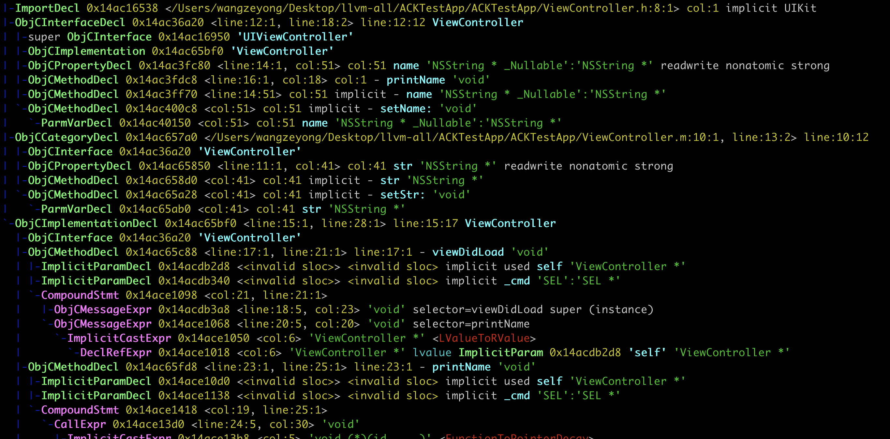
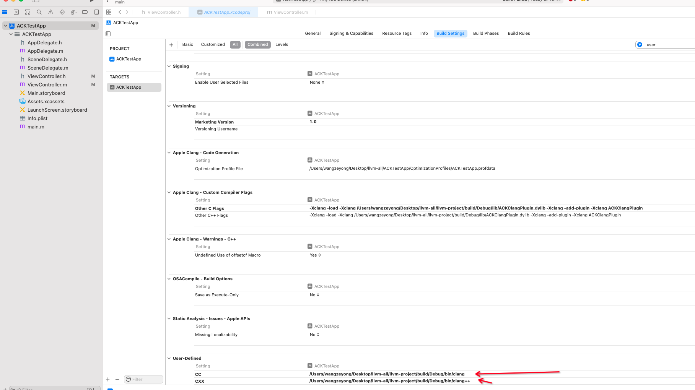
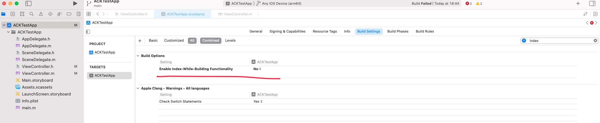
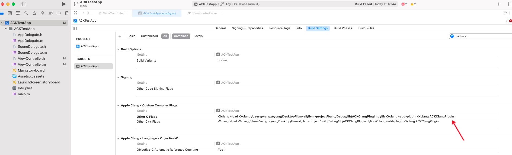
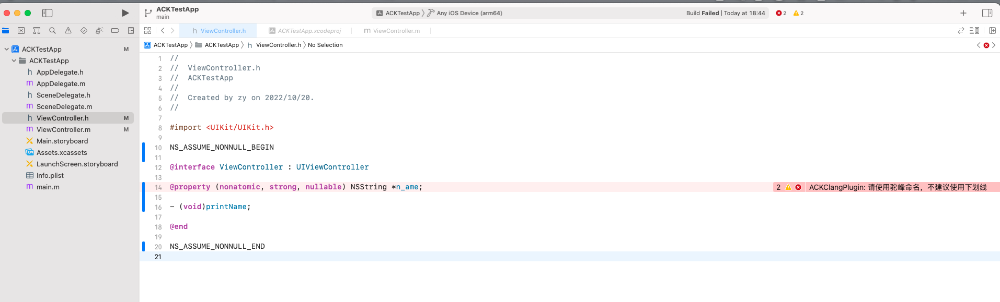
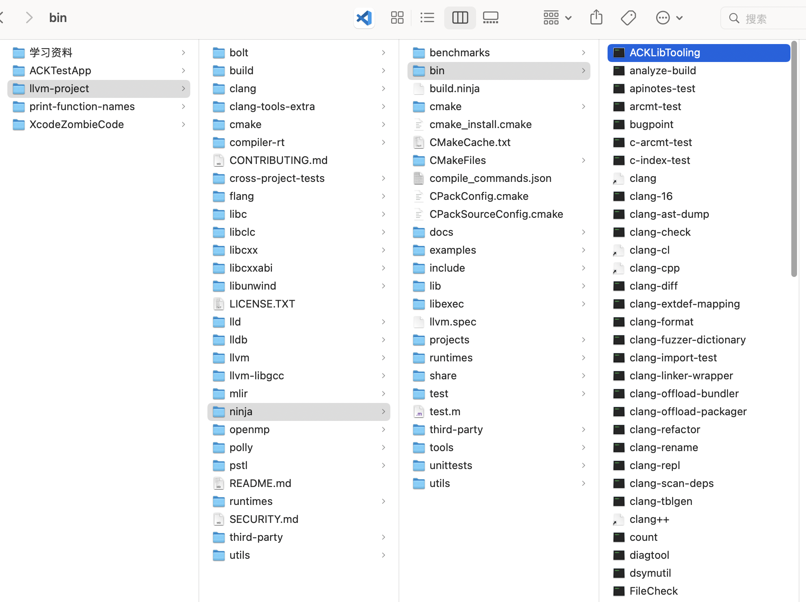
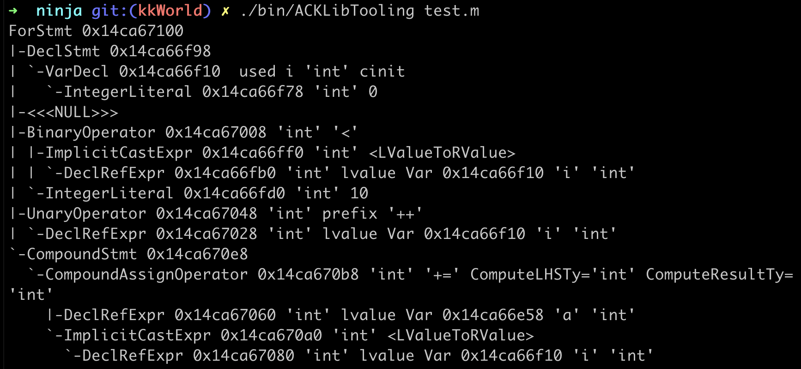

- [概念](#概念)
- [编译的主要流程](#编译的主要流程)
  - [输入文件](#输入文件)
  - [预处理](#预处理)
  - [编译阶段](#编译阶段)
  - [后端](#后端)
  - [链接](#链接)
  - [绑定](#绑定)
- [如何利用Clang提升开发质量](#如何利用clang提升开发质量)
  - [Clang提供了什么能力？](#clang提供了什么能力)
    - [libClang](#libclang)
    - [Clang Plugins](#clang-plugins)
    - [LibTooling](#libtooling)
- [我的第一个Clang插件](#我的第一个clang插件)
  - [编译 llvm-project](#编译-llvm-project)
  - [编写clang plugin的准备工作](#编写clang-plugin的准备工作)
  - [编写clang plugin](#编写clang-plugin)
- [Xcode集成Clang插件](#xcode集成clang插件)
  - [指定clang](#指定clang)
  - [关闭 Enable Index-While-Building Functionality](#关闭-enable-index-while-building-functionality)
  - [指定需要额外加载的clang plugin](#指定需要额外加载的clang-plugin)
  - [编译结果](#编译结果)
- [我的第一个LibTooling](#我的第一个libtooling)
  - [使用ninja编译llvm项目](#使用ninja编译llvm项目)
  - [创建libtooling](#创建libtooling)
  - [使用LibTooling](#使用libtooling)


# 概念

- LLVM
  Low Level Virtual Machine，由 Chris Lattner（Swift 作者） 用于 Objective-C 和 Swift 的编译，后来又加上了很多功能可用于常规编译器、JIT 编译器、调试器、静态分析工具等。总结来说，LLVM 是工具链技术与一个模块化和可重用的编译器的集合。
- Clang
  是 LLVM 的子项目，可以对 C、C++和 Objective-C 进行快速编译，编译速度比 GCC 快 3 倍。Clang 可以认为是 Objective-C 的编译前端，LLVM 是编译后端，前端调用后端接口完成任务。Swift 则有自己的编译前端 SIL optimizer，编译后端同样用的是 LLVM。
- AST
  抽象语法树，按照层级关系排列。
- IR
  中间语言，具有与语言无关的特性，整体结构为 Module(一个文件)--Function--Basic Block–Instruction(指令)。
- 编译器
  编译器用于把代码编译成机器码，机器码可以直接在 CPU 上面运行。好处是运行效率高，坏处是调试周期长，需要重新编译一次（OC 改完代码需要重新运行）。
- 解释器
  解释器会在运行时解释执行代码，会一段一段的把代码翻译成目标代码，然后执行目标代码。好处是具有动态性，调试及时（类似 Flutter、Playground），坏处是执行效率低。平时在调试代码的时候，使用解释器会提高效率。

# 编译的主要流程


通过命令行查看源码的编译流程
```shell
➜  bin git:(main) ✗ ./clang -isysroot /Applications/Xcode_14.0.app/Contents/Developer/Platforms/iPhoneSimulator.platform/Developer/SDKs/iPhoneSimulator16.0.sdk/ -ccc-print-phases  /Users/wangzeyong/Desktop/llvm-all/ACKTestApp/ACKTestApp/ViewController.m
               +- 0: input, "/Users/wangzeyong/Desktop/llvm-all/ACKTestApp/ACKTestApp/ViewController.m", objective-c
            +- 1: preprocessor, {0}, objective-c-cpp-output
         +- 2: compiler, {1}, ir
      +- 3: backend, {2}, assembler
   +- 4: assembler, {3}, object
+- 5: linker, {4}, image
6: bind-arch, "arm64", {5}, image
```
## 输入文件
   - 找到源文件。`"/Users/wangzeyong/Desktop/llvm-all/ACKTestApp/ACKTestApp/ViewController.m", objective-c`
## 预处理
   处理宏替换，头文件的导入
   ```shell
   clang -isysroot /Applications/Xcode_14.0.app/Contents/Developer/Platforms/iPhoneSimulator.platform/Developer/SDKs/iPhoneSimulator16.0.sdk/ -E /Users/wangzeyong/Desktop/llvm-all/ACKTestApp/ACKTestApp/ViewController.m >> ViewController2.m
   ```
   [ViewController2](./ViewController2.m)
## 编译阶段
   词法分析、语法分析、检测语法是否正确，生成中间代码IR
   - 词法分析。会把代码切成一个个token，比如大小括号，等于号等等
     ```shell
     clang -isysroot /Applications/Xcode_14.0.app/Contents/Developer/Platforms/iPhoneSimulator.platform/Developer/SDKs/iPhoneSimulator16.0.sdk/ -fmodules -fsyntax-only -Xclang -dump-tokens /Users/wangzeyong/Desktop/llvm-all/ACKTestApp/ACKTestApp/ViewController.m
     ```
     [词法分析](./%E8%AF%8D%E6%B3%95%E5%88%86%E6%9E%90.txt)
   - 语法分析。生成语法树
     ```shell
     ./clang -isysroot /Applications/Xcode_14.0.app/Contents/Developer/Platforms/iPhoneSimulator.platform/Developer/SDKs/iPhoneSimulator16.0.sdk/ -fmodules -fsyntax-only -Xclang -ast-dump /Users/wangzeyong/Desktop/llvm-all/ACKTestApp/ACKTestApp/ViewController.m
     ``` 
     
     [语法分析](./%E8%AF%AD%E6%B3%95%E5%88%86%E6%9E%90.txt)
     其中，主要说明几个关键字的含义
     - FunctionDecl 函数
     - ParmVarDecl 参数
     - CallExpr 调用一个函数
     - BinaryOperator 运算符
   - 生成中间代码IR
## 后端
llvm通过pass优化，最终生成汇编代码
## 链接
链接需要的动态库和静态库，生成可执行文件
## 绑定
通过不同的架构，生成对应的可执行文件

# 如何利用Clang提升开发质量
工作中，经常发生线上事故，复盘时很多都是因为代码不规范导致。
代码规范执行不到位，从而导致代码质量差，无法监管，我们才被动处理线上事故。
那我们到底怎么改善呢？
好的监控手段需要我们自己动手建设，通过clang提供的丰富接口功能，我们可以开发出静态分析工具，进而管控代码质量。

## Clang提供了什么能力？
### libClang
LibClang 提供了稳定的高级C接口，Xcode使用的就是LibClang。
LibClang 可以访问 Clang 的上层高级抽象的能力，比如获取所有的 Token、遍历语法树、代码补全等。
由于 API 很稳定， Clang 版本更新对其影响不大。
但是 LibClang 并不能完全访问到 Clang AST 信息。
### Clang Plugins
Clang Plugins 可以让你在 AST 上做些操作，这些操作能够集成到编译中，成为编译的一部分。
插件是在运行时由编译器加载的动态库，方便集成到构建系统中。
使用 Clang Plugins 一般都是希望能够完全控制 Clang AST，同时能够集成在编译流程中，可以影响编译的过程，进行中断或者提示。
### LibTooling
LibTooling 是一个 C++ 接口，通过 LibTooling 能够编写独立运行的语法检查和代码重构工具。
LibTooling 的优势如下：
 - 所写的工具不依赖于构建系统，可以作为一个命令单独使用，比如 clang-check、clang-fixit、clang-format；
 - 可以完全控制 Clang AST；
 - 能够和 Clang Plugins 共用一份代码。

与 Clang Plugins 相比，LibTooling 无法影响编译过程；
与 LibClang 相比，LibTooling 的接口没有那么稳定，也无法开箱即用，当 AST 的 API 升级后需要更新接口的调用。
但是，LibTooling 基于能够完全控制 Clang AST 和可独立运行的特点，可以做的事情就非常多了。
 - 改变代码：可以改变 Clang 生成代码的方式。基于现有代码可以做出大量的修改。还可以进行语言的转换，比如把 OC 语言转成 JavaScript 或者 Swift。
 - 做检查：检查命名规范，增加更强的类型检查，还可以按照自己的定义进行代码的检查分析。
 - 做分析：对源码做任意类型分析，甚至重写程序。给 Clang 添加一些自定义的分析，创建自己的重构器，还可以基于工程生成相关图形或文档进行分析。

# 我的第一个Clang插件
## 编译 llvm-project
- git clone https://github.com/llvm/llvm-project.git
- cd llvm-project
- mkdir build
- cd build
- cmake -DLLVM_ENABLE_PROJECTS=clang -DCMAKE_BUILD_TYPE=Release -G Xcode ../llvm
  - 使用Xcode编译项目，方便编写cpp文件
  - 也可使用官方推荐的其他方式编译，例如：Ninja（速度相对快一些）
  - 如果本地没有安装cmake，则需要安装。brew install cmake
- open LLVM.xcodeproj
- 选中Automatically Creat Schemes后，在选择all_build，cmd+b即可开始编译
  - 个人习惯选择all_build,也可选择手动创建需要的schemes
  - M1选择all_build速度比传闻的一小时要快很多，我的电脑大概十几分钟
- 记录编译出来的clang、clang++（后面有用）
  - /Users/xxx/Desktop/llvm-all/llvm-project/build/Debug/bin/clang
  - /Users/xxx/Desktop/llvm-all/llvm-project/build/Debug/bin/clang++
## 编写clang plugin的准备工作
- cd /llvm-project/clang/tools
- mkdir ACKClangPlugin
- cd ACKClangPlugin
- touch ACKClangPlugin.cpp
- touch CMakeLists.txt
- st CMakeLists.txt（打开CMakeLists.txt文件，添加下一步的描述文字）
- add_llvm_library( ACKClangPlugin MODULE ACKClangPlugin.cpp) 
- cd .. 
- st CMakeLists.txt(打开llvm-project/clang/tools下的CMakeLists.txt文件，并添加下一步的描述文字)
- add_clang_subdirectory(ACKClangPlugin)
## 编写clang plugin
- cd /llvm-project/build
- cmake -DLLVM_ENABLE_PROJECTS=clang -DCMAKE_BUILD_TYPE=Release -G Xcode ../llvm (重新编译Xcode工程)
- open LLVM.xcodeproj
- 重新选择Automatically Creat Schemes
- 此时项目中已经有ACKClangPlugin.cpp文件，我们的插件在此编写
 ```c++
    #include <iostream>
    #include "clang/AST/AST.h"
    #include "clang/AST/ASTConsumer.h"
    #include "clang/ASTMatchers/ASTMatchers.h"
    #include "clang/ASTMatchers/ASTMatchFinder.h"
    #include "clang/Frontend/CompilerInstance.h"
    #include "clang/Frontend/FrontendPluginRegistry.h"
    using namespace clang;
    using namespace std;
    using namespace llvm;
    using namespace clang::ast_matchers;

    namespace ACKClangPlugin {
        class TestHandler : public MatchFinder::MatchCallback{
        private:
            CompilerInstance &ci;
  
        public:
            TestHandler(CompilerInstance &ci) :ci(ci) {}
            
            //判断是否是用户源文件
            bool isUserSourceCode(const string filename) {
                //文件名不为空
                if (filename.empty()) return  false;
                //非xcode中的源码都认为是用户的
                if (filename.find("/Applications/Xcode_14.0.app/") == 0) return false;
                return  true;
            }
      
            // 代码检查的回调方法
            void run(const MatchFinder::MatchResult &Result) {
    
                // 检查类名(Interface)，不能带有下划线
                if (const ObjCInterfaceDecl *decl = Result.Nodes.getNodeAs<ObjCInterfaceDecl>("ObjCInterfaceDecl")) {
                    string filename = ci.getSourceManager().getFilename(decl->getSourceRange().getBegin()).str();
                    if ( !isUserSourceCode(filename) ) return;
                    size_t pos = decl->getName().find('_');
                    if (pos != StringRef::npos) {
                        DiagnosticsEngine &D = ci.getDiagnostics();
                        // 获取位置
                        SourceLocation loc = decl->getLocation().getLocWithOffset(pos);
                        D.Report(loc, D.getCustomDiagID(DiagnosticsEngine::Warning, "ACKClangPlugin：类名中不能带有下划线"));
                    }
                }
                // 检查变量(Interface)，不能带有下划线
                if (const VarDecl *decl = Result.Nodes.getNodeAs<VarDecl>("VarDecl")) {
                    string filename = ci.getSourceManager().getFilename(decl->getSourceRange().getBegin()).str();
                    if ( !isUserSourceCode(filename) ) return;
                    size_t pos = decl->getName().find('_');
                    if (pos != StringRef::npos && pos != 0) {
                        DiagnosticsEngine &D = ci.getDiagnostics();
                        SourceLocation loc = decl->getLocation().getLocWithOffset(pos);
                        D.Report(loc, D.getCustomDiagID(DiagnosticsEngine::Warning, "ACKClangPlugin：请使用驼峰命名，不建议使用下划线"));
                        D.Report(loc, D.getCustomDiagID(DiagnosticsEngine::Error, "ACKClangPlugin: 请使用驼峰命名，不建议使用下划线"));
                    }
                }
            }
        };
    
        // 定义语法树的接受事件
        class TestASTConsumer: public ASTConsumer{
        private:
            MatchFinder matcher;
            TestHandler handler;
            
        public:
            TestASTConsumer(CompilerInstance &ci) :handler(ci) {
                matcher.addMatcher(objcInterfaceDecl().bind("ObjCInterfaceDecl"), &handler);
                matcher.addMatcher(varDecl().bind("VarDecl"), &handler);
                matcher.addMatcher(objcMethodDecl().bind("ObjCMethodDecl"), &handler);
            }
            void HandleTranslationUnit(ASTContext &Ctx) {
                printf("ACKClangPlugin: All ASTs has parsed.");
                DiagnosticsEngine &D = Ctx.getDiagnostics();
                matcher.matchAST(Ctx);
            }
        };
    
        // 定义触发插件的动作
        class TestAction : public PluginASTAction{
        public:
            unique_ptr<ASTConsumer> CreateASTConsumer(CompilerInstance &CI,
                                                    StringRef InFile){
                return unique_ptr<TestASTConsumer> (new TestASTConsumer(CI));
                
            }
    
    
            bool ParseArgs(const CompilerInstance &CI,
                        const std::vector<std::string> &arg){
                return true;
            }
        };
    }
    
    // 告知clang,注册一个新的plugin
    static FrontendPluginRegistry::Add<ACKClangPlugin::TestAction>
    X("ACKClangPlugin", "ACKClangPlugin a new Plugin");
    // X 变量名，可随便写，也可以写自己有意思的名称
    // ACKClangPlugin  插件名称，️很重要，这个是对外的名称
    // ACKClangPlugin a new Plugin  插件备注   
 ```
- scheme中选择ACKClangPlugin，编译。
- 记录编译出的ACKClangPlugin.dylib路径
  - /Users/xxx/Desktop/llvm-all/llvm-project/build/Debug/lib/ACKClangPlugin.dylib

# Xcode集成Clang插件
## 指定clang
- Xcode默认使用的是自带的clang前端，所以在Xcode中我们需要增加CC和CXX参数来指定我们自己的clang地址。
- 在配置文件中新增CC和CXX绝对路径，也就是clang和clang++的绝对路径
- 注：在编译llvm-project中有记录
  ```shell
    /// 注意：key为大写。
    CC = /Users/wangzeyong/Desktop/llvm-all/llvm-project/build/Debug/bin/clang
    CXX =/Users/wangzeyong/Desktop/llvm-all/llvm-project/build/Debug/bin/clang++
  ```
  
## 关闭 Enable Index-While-Building Functionality

## 指定需要额外加载的clang plugin
- 在配置文件中搜索other c即可快速查询
- 增加如下内容
  ```shell
    -Xclang -load 插件地址(dylib的地址) -Xclang -add-plugin -Xclang 插件名
    // 实例
    -Xclang -load -Xclang /Volumes/ExDisk/LLVM/llvm/llvm_xcode/Debug/lib/TestPlugin1.dylib -Xclang -add-plugin -Xclang TestPlugin
  ```
  
## 编译结果


# 我的第一个LibTooling
## 使用ninja编译llvm项目
- cd llvm-project
- mkdir ninja
- cd ninja
- cmake -DLLVM_ENABLE_PROJECTS=clang -DCMAKE_BUILD_TYPE=Release -G Ninja ../llvm
  - 如果没有ninja，则需要安装。brew install ninja
- ninja
- ninja install
## 创建libtooling
- cd llvm-project
- cd clang/tools
- mkdir ACKLibTooling
- cd ACKLibTooling
- touch ACKLibTooling.cpp
- touch CMakeLists.txt
- code CMakeLists.txt (打开文件，并添加下一步的描述)
  ```c++
    set(LLVM_LINK_COMPONENTS support)
    add_clang_tool(ACKLibTooling
      ACKLibTooling.cpp
    )
 
    clang_target_link_libraries(ACKLibTooling
      PRIVATE
      clangAST
      clangASTMatchers
      clangBasic
      clangFrontend
      clangSerialization
      clangTooling
    )
  ```
  - cd ../
  - echo 'add_subdirectory(ACKLibTooling)' >> CMakeLists.txt
  - code ACKLibTooling.cpp (打开文件，并添加下一步的代码)
  ```c++
  // Declares clang::SyntaxOnlyAction.
    #include "clang/Frontend/FrontendActions.h"
    #include "clang/Tooling/CommonOptionsParser.h"
    #include "clang/Tooling/Tooling.h"
    // Declares llvm::cl::extrahelp.
    #include "llvm/Support/CommandLine.h"
    #include "clang/ASTMatchers/ASTMatchers.h"
    #include "clang/ASTMatchers/ASTMatchFinder.h"
    
    
    using namespace llvm;
    using namespace clang;
    using namespace clang::tooling;
    using namespace clang::ast_matchers;
    
    
    // Apply a custom category to all command-line options so that they are the
    // only ones displayed.
    static llvm::cl::OptionCategory MyToolCategory("my-tool options");
    
    
    // CommonOptionsParser declares HelpMessage with a description of the common
    // command-line options related to the compilation database and input files.
    // It's nice to have this help message in all tools.
    static cl::extrahelp CommonHelp(CommonOptionsParser::HelpMessage);
    
    
    // A help message for this specific tool can be added afterwards.
    static cl::extrahelp MoreHelp("\nMore help text...\n");
    
    
    StatementMatcher LoopMatcher =
    forStmt(hasLoopInit(declStmt(hasSingleDecl(varDecl(
        hasInitializer(integerLiteral(equals(0)))))))).bind("forLoop");
    
    
    class LoopPrinter : public MatchFinder::MatchCallback {
    public :
    virtual void run(const MatchFinder::MatchResult &Result) {
        // 绑定for循环
        if (const ForStmt *FS = Result.Nodes.getNodeAs<clang::ForStmt>("forLoop"))
            // 打印for循环表达式的抽象语法树
            FS->dump();
    }
    };
    
    
    int main(int argc, const char **argv) {
    auto ExpectedParser = CommonOptionsParser::create(argc, argv, MyToolCategory);
    if (!ExpectedParser) {
        // Fail gracefully for unsupported options.
        llvm::errs() << ExpectedParser.takeError();
        return 1;
    }
    CommonOptionsParser& OptionsParser = ExpectedParser.get();
    ClangTool Tool(OptionsParser.getCompilations(),
                    OptionsParser.getSourcePathList());
    
    
    LoopPrinter Printer;
    MatchFinder Finder;
    Finder.addMatcher(LoopMatcher, &Printer);
    
    
    return Tool.run(newFrontendActionFactory(&Finder).get());
    }
  ``` 
  - cd llvm-project/ninja
  - ninja
  - 此时可见编译好的libtooling在llvm-project/ninja/bin/目录下
  
  ## 使用LibTooling
  - 创建一个测试文件test.m
  ```c
    int main(void)
    {
        int a = 0;
        for(int i= 0; i < 10; ++i) {
            a += i;
        }
        return a;
    }
  ```
  - ./bin/ACKLibTooling test.m
    - for循环的抽象语法树被打印出来
    