- [玩转 Stable diffusion（落地实操版）](#玩转-stable-diffusion落地实操版)
  - [什么是 Midjourney、Stable Diffusion](#什么是-midjourneystable-diffusion)
  - [为什么选择 Stable Diffusion？](#为什么选择-stable-diffusion)
  - [开发环节，先在iOS上跑起来（简述）](#开发环节先在ios上跑起来简述)
    - [Core ML Stable Diffusion](#core-ml-stable-diffusion)
    - [下载模型](#下载模型)
    - [模型解压缩](#模型解压缩)
    - [生成 StableDiffusionPipeline](#生成-stablediffusionpipeline)
    - [文生图](#文生图)
    - [证书设置](#证书设置)
    - [最终效果](#最终效果)
  - [在各种设备上把 Stable Diffusion 玩起来](#在各种设备上把-stable-diffusion-玩起来)
    - [iOS](#ios)
    - [MacOS](#macos)
      - [Draw Things App](#draw-things-app)
      - [Stable Diffusion WebUI](#stable-diffusion-webui)
        - [SD Web UI 环境搭建 （略）](#sd-web-ui-环境搭建-略)
    - [Windows PC](#windows-pc)
    - [云服务器](#云服务器)
      - [傻瓜式部署流程](#傻瓜式部署流程)
  - [不同方案的优势和限制](#不同方案的优势和限制)
    - [iPhone、iPad](#iphoneipad)
    - [Mac OS](#mac-os)
      - [使用 Draw Things App：](#使用-draw-things-app)
      - [使用 Stable Diffusion Web UI](#使用-stable-diffusion-web-ui)
    - [Windows PC](#windows-pc-1)
      - [使用 Stable Diffusion Web UI](#使用-stable-diffusion-web-ui-1)
    - [云服务器](#云服务器-1)
      - [使用 Stable Diffusion Web UI](#使用-stable-diffusion-web-ui-2)
  - [手把手教你生成一张专业摄影图](#手把手教你生成一张专业摄影图)
  - [手把手教你给模特换装](#手把手教你给模特换装)
  - [ControlNet的其他妙用](#controlnet的其他妙用)


# 玩转 Stable diffusion（落地实操版）
## 什么是 Midjourney、Stable Diffusion
举个例子：   
可以将他们类比为画家的手和工具，根据你打的文字和选择的不同参数，来画出你想要的作品。  
但是画出什么风格的作品，取决于模型。  
可以把模型类比为画家的大脑，提示词和参数就是灵感。  

## 为什么选择 Stable Diffusion？
1. 可以在大多数配备有适度GPU的电脑硬件上运行  
2. 项目代码及模型权重开源，开源社区开发者可以在它的基础上进行二次开发  
3. 免费、无需注册
4. 与 Midjourney 相比，配置略微繁琐。（过去式，下面将分享傻瓜式教程）

## 开发环节，先在iOS上跑起来（简述）
### Core ML Stable Diffusion
[github](https://github.com/apple/ml-stable-diffusion)  
苹果专门为 Stable Diffusion 推出的工具，作用有两个：  
1. 将模型转换为 CoreML 格式
2. 以 Swift 代码调用 CoreML 模型实现图像生成。
3. 支持 CPU、GPU、NE（神经引擎、专为深度学习任务设计的硬件加速器） 等多种运行方式

### 下载模型
Huggingface上已有转换好的模型，我们可以直接下载。  
```swift
    @discardableResult
    func download() async throws -> URL {
        if ready || downloaded { return downloadedURL }
        
        let downloader = Downloader(from: url, to: downloadedURL)
        self.downloader = downloader
        downloadSubscriber = downloader.downloadState.sink { state in
            if case .downloading(let progress) = state {
                self.state = .downloading(progress)
            }
        }
        try downloader.waitUntilDone()
        return downloadedURL
    }
```
### 模型解压缩
```swift
    func unzip() async throws {
        guard downloaded else { return }
        state = .uncompressing
        do {
            try FileManager().unzipItem(at: downloadedURL, to: uncompressPath.url)
        } catch {
            // Cleanup if error occurs while unzipping
            try uncompressPath.delete()
            throw error
        }
        try downloadedPath.delete()
        state = .readyOnDisk
    }
```

### 生成 StableDiffusionPipeline
```swift
     func load(url: URL) async throws -> StableDiffusionPipeline {
        let beginDate = Date()
        let configuration = MLModelConfiguration()
        configuration.computeUnits = computeUnits
        let pipeline = try StableDiffusionPipeline(resourcesAt: url,
                                                   configuration: configuration,
                                                   disableSafety: false,
                                                   reduceMemory: model.reduceMemory)
        print("Pipeline loaded in \(Date().timeIntervalSince(beginDate))")
        state = .loaded
        return pipeline
    }
```

### 文生图

```swift
    /// Text to image generation using stable diffusion
    ///
    /// - Parameters:
    ///   - prompt: Text prompt to guide sampling
    ///   - negativePrompt: Negative text prompt to guide sampling
    ///   - stepCount: Number of inference steps to perform
    ///   - imageCount: Number of samples/images to generate for the input prompt
    ///   - seed: Random seed which
    ///   - guidanceScale: Controls the influence of the text prompt on sampling process (0=random images)
    ///   - disableSafety: Safety checks are only performed if `self.canSafetyCheck && !disableSafety`
    ///   - progressHandler: Callback to perform after each step, stops on receiving false response
    /// - Returns: An array of `imageCount` optional images.
    ///            The images will be nil if safety checks were performed and found the result to be un-safe
    public func generateImages(
        prompt: String,
        negativePrompt: String = "",
        imageCount: Int = 1,
        stepCount: Int = 50,
        seed: UInt32 = 0,
        guidanceScale: Float = 7.5,
        disableSafety: Bool = false,
        scheduler: StableDiffusionScheduler = .pndmScheduler,
        progressHandler: (Progress) -> Bool = { _ in true }
    ) throws -> [CGImage?] {

        // Encode the input prompt and negative prompt
        let promptEmbedding = try textEncoder.encode(prompt)
        let negativePromptEmbedding = try textEncoder.encode(negativePrompt)

        if reduceMemory {
            textEncoder.unloadResources()
        }

        // Convert to Unet hidden state representation
        // Concatenate the prompt and negative prompt embeddings
        let concatEmbedding = MLShapedArray<Float32>(
            concatenating: [negativePromptEmbedding, promptEmbedding],
            alongAxis: 0
        )

        let hiddenStates = toHiddenStates(concatEmbedding)

        /// Setup schedulers
        let scheduler: [Scheduler] = (0..<imageCount).map { _ in
            switch scheduler {
            case .pndmScheduler: return PNDMScheduler(stepCount: stepCount)
            case .dpmSolverMultistepScheduler: return DPMSolverMultistepScheduler(stepCount: stepCount)
            }
        }
        let stdev = scheduler[0].initNoiseSigma

        // Generate random latent samples from specified seed
        var latents = generateLatentSamples(imageCount, stdev: stdev, seed: seed)

        // De-noising loop
        for (step,t) in scheduler[0].timeSteps.enumerated() {

            // Expand the latents for classifier-free guidance
            // and input to the Unet noise prediction model
            let latentUnetInput = latents.map {
                MLShapedArray<Float32>(concatenating: [$0, $0], alongAxis: 0)
            }

            // Predict noise residuals from latent samples
            // and current time step conditioned on hidden states
            var noise = try unet.predictNoise(
                latents: latentUnetInput,
                timeStep: t,
                hiddenStates: hiddenStates
            )

            noise = performGuidance(noise, guidanceScale)

            // Have the scheduler compute the previous (t-1) latent
            // sample given the predicted noise and current sample
            for i in 0..<imageCount {
                latents[i] = scheduler[i].step(
                    output: noise[i],
                    timeStep: t,
                    sample: latents[i]
                )
            }

            // Report progress
            let progress = Progress(
                pipeline: self,
                prompt: prompt,
                step: step,
                stepCount: stepCount,
                currentLatentSamples: latents,
                isSafetyEnabled: canSafetyCheck && !disableSafety
            )
            if !progressHandler(progress) {
                // Stop if requested by handler
                return []
            }
        }

        if reduceMemory {
            unet.unloadResources()
        }

        // Decode the latent samples to images
        return try decodeToImages(latents, disableSafety: disableSafety)
    }
```
### 证书设置
因为占用内存较大，需要打开以下两个选项。  
1. Extended Virtual Addressing
2. Increased Memory Limit

### 最终效果


## 在各种设备上把 Stable Diffusion 玩起来
### iOS
在手机上可以通过 Draw Things 这款 App 来使用 Stable Diffusion，不用连网完全本地运行出图，不过目前对手机型号和系统版本有如下要求：  
- 手机设备要求 iPhone XS、XS Max、Xr、11、11 Pro、11 Pro Max、SE 2nd Gen、12、12 Mini、12 Pro、12 Pro Max、SE 3rd Gen、13、13 Mini、13 Pro、13 Pro Max、14、14 Plus、14 Pro、14 Pro Max，要求系统在 iOS 15.4 及以上。
- 平板设备要求 iPad Air、Mini、Pro，要求系统在 iPadOS 15.4 及以上。  

### MacOS
要想在苹果 macOS 系统的电脑上把 Stable Diffusion 玩起来，有两种方案：  
#### Draw Things App
   - 设备要求:
     - M1/M2 芯片的 Mac Mini、Mac Studio、MacBook Air、MacBook Pro，且 macOS 系统版本在 12.4 及以上。
   - Draw Things 的基础功能：
     - 文字生成图片
     - 文字+图片生成图片
     - 内补绘制（Inpainting）
       - 计算机视觉领域的一个任务，目的是将图片中丢失或者被损坏的部分修复，让图片恢复完整。
       - 可用于老照片修复等场景。 
     - 外补绘制（Outpainting）
       - 也被称为图像扩展或者图像预测，是计算机视觉领域的另一个任务，其目标是从已有的图像内容中预测出图像外部可能的内容。
       - 举个例子，如果你有一张海滩的图片，外补绘制算法可能会生成海滩外的海洋或者沙滩上的其他部分。

#### Stable Diffusion WebUI
在苹果电脑本地玩 Stable Diffusion 的另外一种方式是安装 [Stable Diffusion WebUI](https://github.com/AUTOMATIC1111/stable-diffusion-webui).  
Stable Diffusion WebUI 是一个开源的基于 Gradio 库开发的用于使用 Stable Diffusion 的 Web 页面项目。  
Gradio 则是专门用于轻松实现 AI 算法可视化部署的开源库。  
简单来讲就是 Stable Diffusion WebUI 提供了一套 Web 页面让我们可以通过在网页上使用 Stable Diffusion 的各种能力。它长这样： 
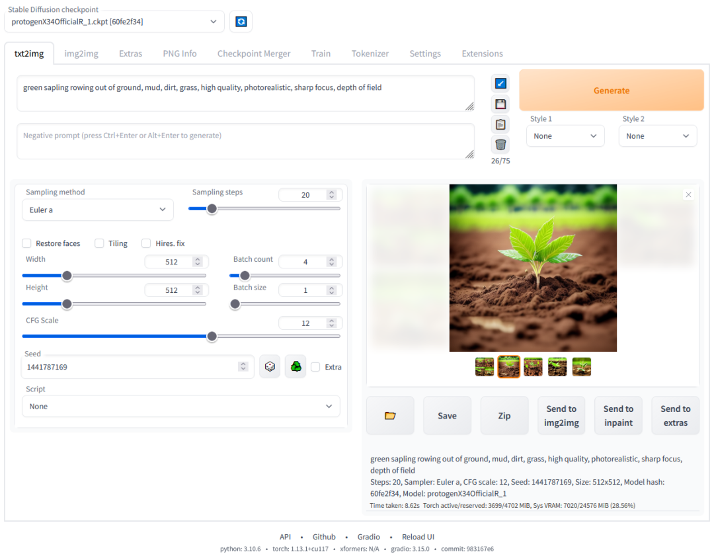

##### SD Web UI 环境搭建 （略）
由于 Stable Diffusion WebUI 使用的 Gradio 是基于 python3 的项目，所以，搭建这套环境最主要的问题是解决 python3 的环境问题。

### Windows PC
要在 Windows PC 电脑上把 Stable Diffusion 搭建起来，首先需要显卡能够满足需要，Stable Diffusion WebUI 的最低显存要求是 4GB。  
如果显卡给力，接下来的工作就跟在 macOS 电脑上搭建的道理类似，就是把 [Stable Diffusion WebUI](https://github.com/AUTOMATIC1111/stable-diffusion-webui)项目及依赖的 python 环境及各种依赖库给下载下来，将项目运行起来。  

### 云服务器
除了在自己的 iOS、macOS、Windows 设备上搭建 Stable Diffusion 的环境之外，我们还可以在云服务器上部署 Stable Diffusion。  
这里依然要感谢有无私的开发贡献者，把整个流程变得非常简单。这里使用的就是巴哈姆特上的一篇文章介绍的开源部署脚本在 Colab 上部署 Stable Diffusion WebUI。  
#### 傻瓜式部署流程
**Important: 根据官方声明，Colab的免费级别不适用于Stable Diffusion WebUI 😭 我们只能在付费计划中使用它。**

访问 Colab 傻瓜式部署 Stable Diffusion WebUI 的脚本
   - 要访问下面的服务，需要具备一定的上网条件，如果条件就绪，你可以打开这个网址：
   - https://colab.research.google.com/drive/1lekLF7iib6M1R-NCylS0VMTF4wve-XuV?usp=sharing。
1. 直接运行部署脚本的『前置步骤』。
   - 点击下列按钮开始执行『前置步骤』：
   - 
   - 成功运行完成后，会看到每一个细分步骤前有一个小绿勾。
2. 选择和下载需要的 SD 模型和 LoRA 模型。
   - 在 2.1 下载 SD 模型 这一步，参考下图选择 ChilloutMix_Ni_fix 模型：
   - 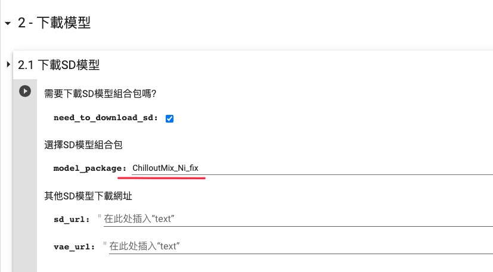
   - 在 2.2 下载 Embedding + Hypernetwork + LoRA 这一步，参考下图选择所有的内置 LoRA 模型：
   - 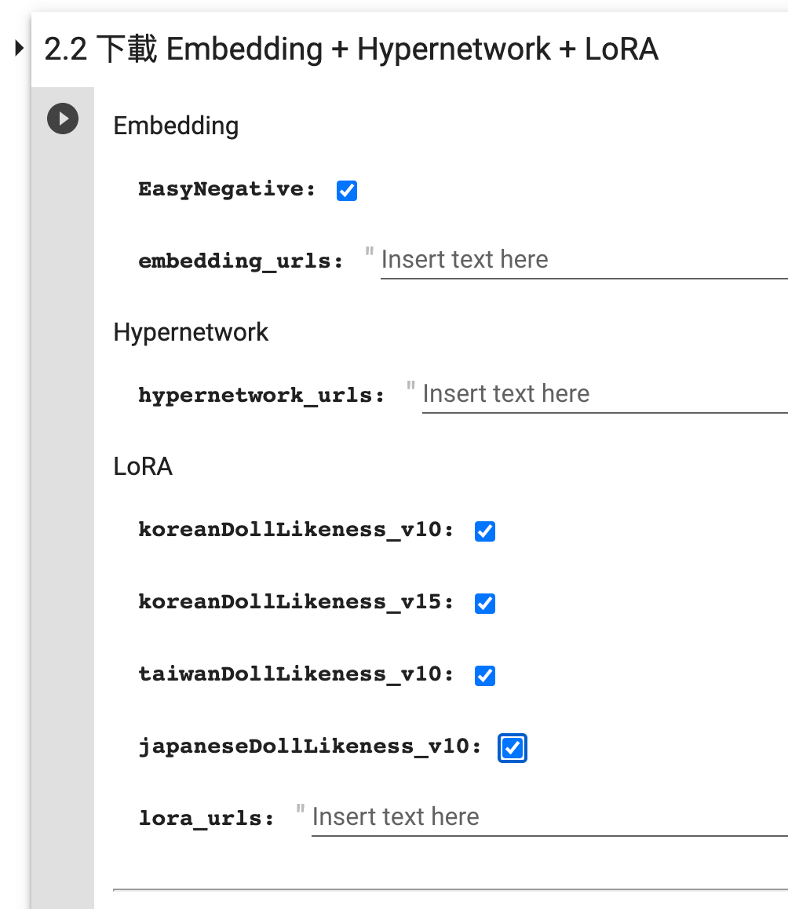
   - 收起 2 - 下载模型，点击下列按钮开始执行『下载模型』：
   - 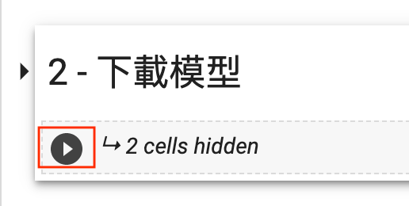
   - 同样的，成功运行完成后，会看到每一个细分步骤前有一个小绿勾。
3. 选择和下载需要的 Extension。
   - 在 3.1 下载&更新 Extensions 这一步勾选需要的扩展：
   - 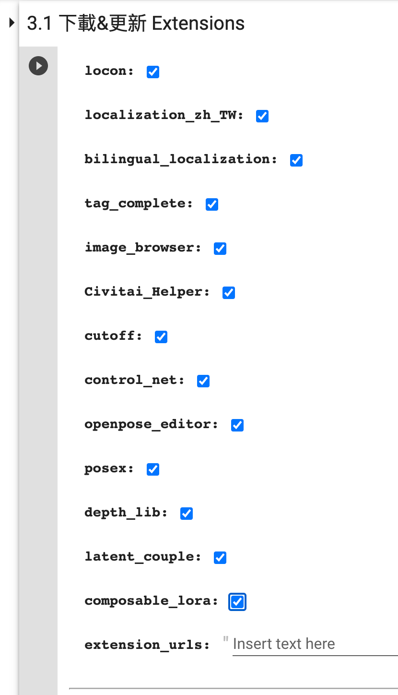
   - 在 3.2 下载 ControlNet 模型 这一步勾选需要的 ControlNet 模型：
   - 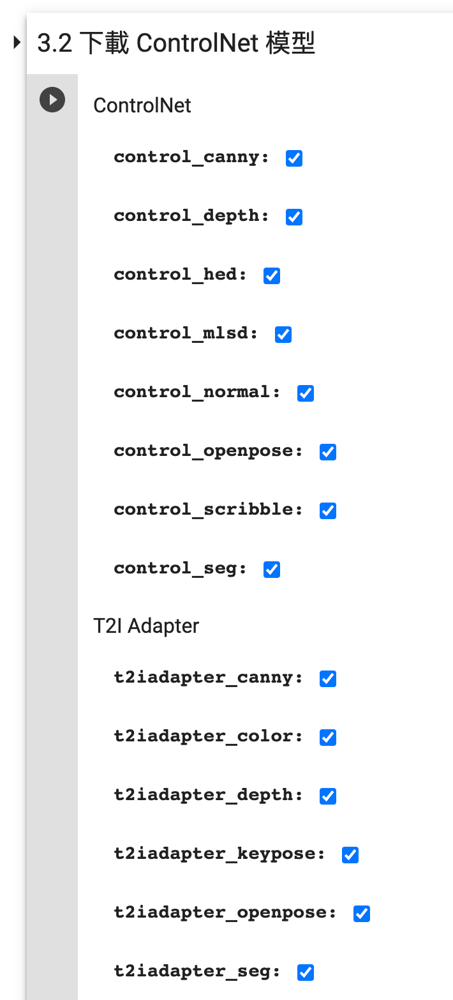
   - 收起 3 - Extension，点击下列按钮开始执行『Extension』：
   - 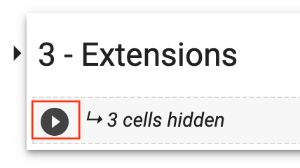
4. 直接执行『其他设置』。
   - 点击下列按钮开始执行『其他设置』：
   - 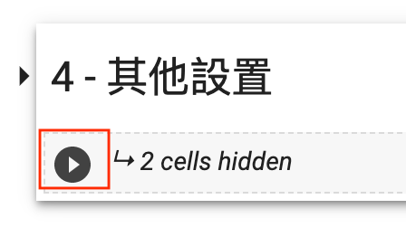
5. 直接执行『启动 WebUI』。
   - 点击下列按钮开始执行『启动 WebUI』：
   - 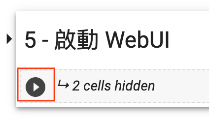
   - 如果顺利运行，到后面你会看到如下输出：
   - 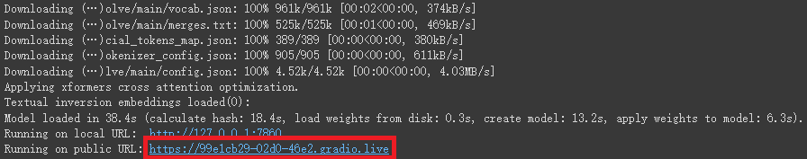
   - 点击 public URL 进入 WebUI 页面即可开始使用了。
## 不同方案的优势和限制
### iPhone、iPad
使用 Draw Things App：
- 优势：
  - 本地出图，随时可玩
  - 使用方便
  - 支持中文（新版本刚支持）
  - 支持选择模型
  - 支持 LoRA
  - 支持 ControlNet
- 限制：
  - 对设备有要求， xs 以上
  - 使用时手机发热
  - 出图速度一般
### Mac OS
#### 使用 Draw Things App：
- 优势：
  - 本地出图，随时可玩
  - 使用方便
  - 支持中文（新版本刚支持）
  - 支持选择模型
  - 支持 LoRA
  - 支持 ControlNet
  - 出图速度还可以 30s 左右
- 限制：
  - 对设备有要求， M1 芯片
#### 使用 Stable Diffusion Web UI
- 优势：
  - 本地出图，随时可玩
  - 支持选择模型
  - 支持 LoRA
  - 支持 ControlNet
  - 有丰富的插件
- 限制：
  - 对设备有要求， M1 芯片
  - 比较吃内存， 建议内存32G以上
  - 使用略复杂
  - 需要部署
  - 出图速度一般

### Windows PC
#### 使用 Stable Diffusion Web UI
- 优势：
  - 本地出图，随时可玩
  - 支持选择模型
  - 支持 LoRA
  - 支持 ControlNet
  - 有丰富的插件
  - 出图速度还可以 15s 左右
- 限制：
  - 要求显卡显存 4GB 以上，内存 16GB 以上
  - 使用略复杂
  - 需要部署

### 云服务器
#### 使用 Stable Diffusion Web UI
- 优势：
  - 不需要考虑硬件资源
  - 支持选择模型
  - 支持 LoRA
  - 支持 ControlNet
  - 有丰富的插件
  - 出图速度还可以 15s 左右
- 限制：
  - 使用略复杂
  - 需要部署
  - 需要联网使用
  - 使用云服务资源可能需要付费

## 手把手教你生成一张专业摄影图
## 手把手教你给模特换装
## ControlNet的其他妙用
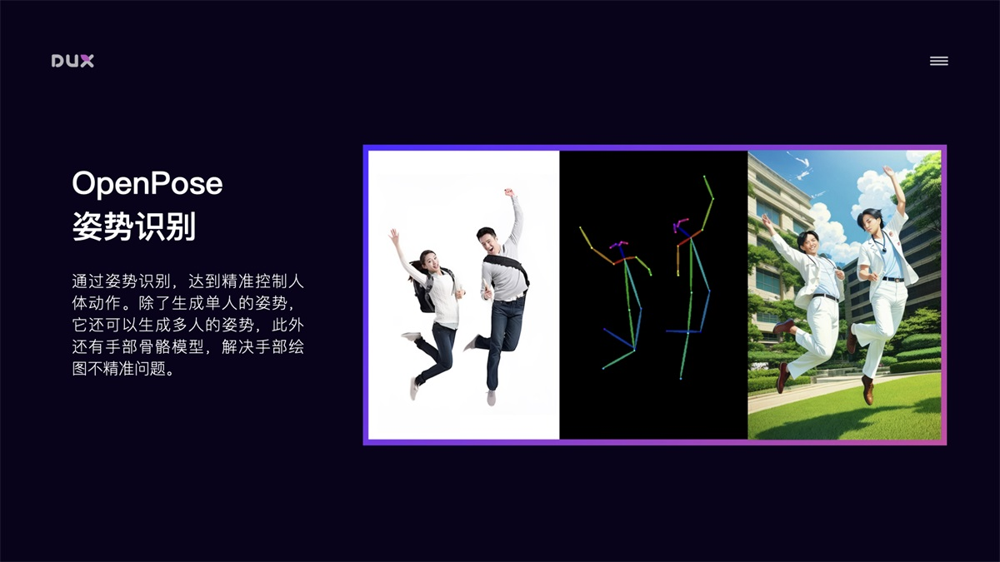
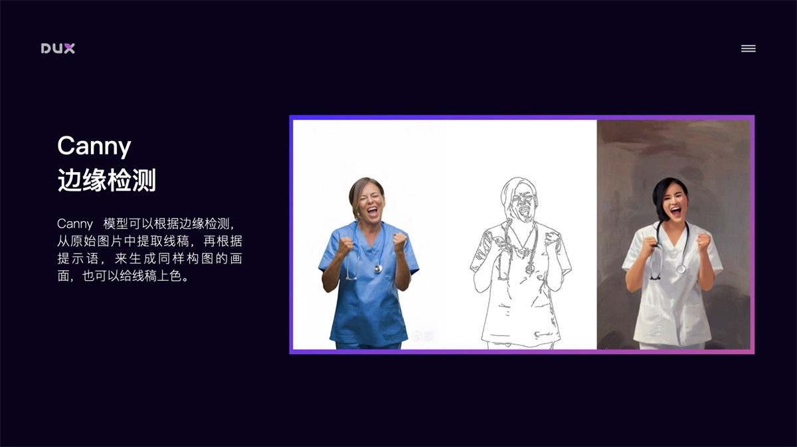

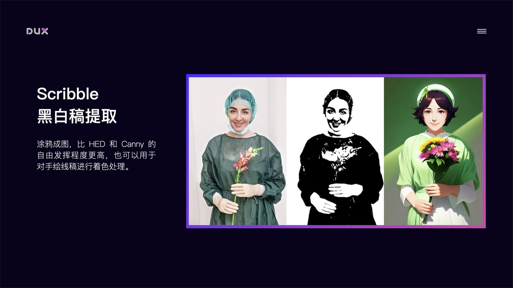
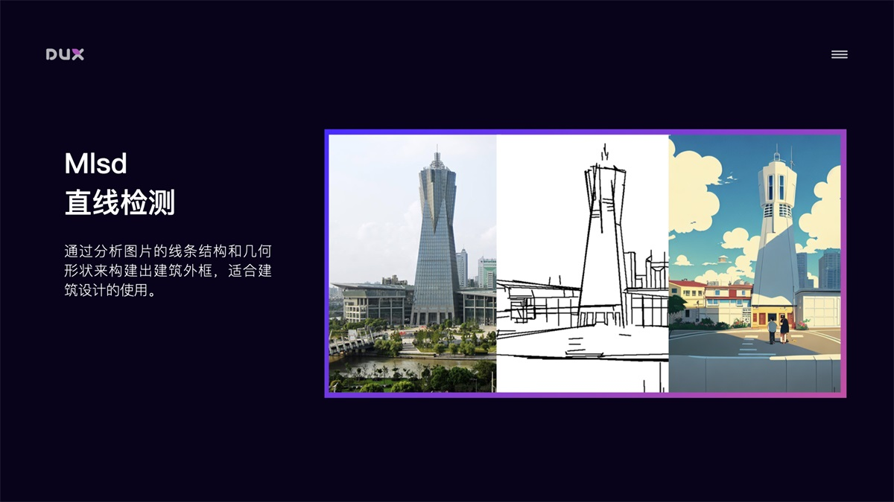

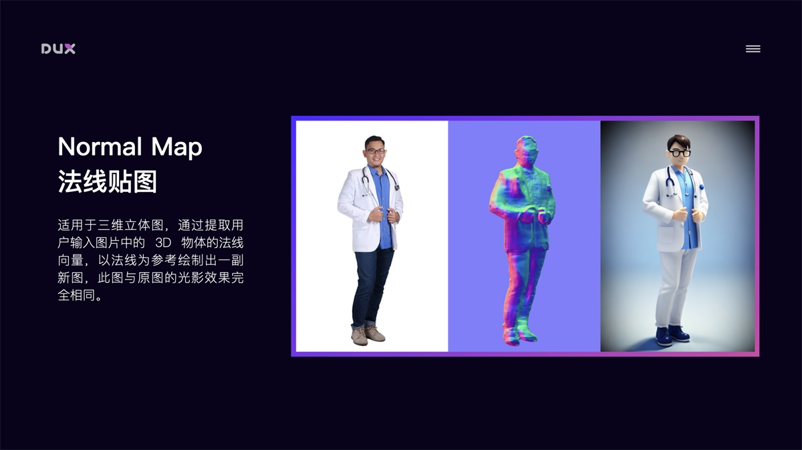
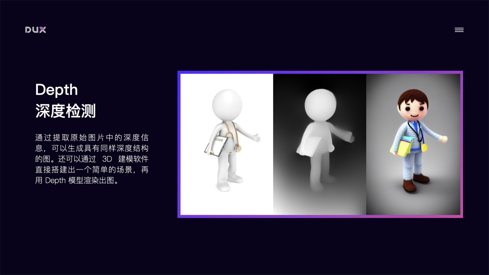